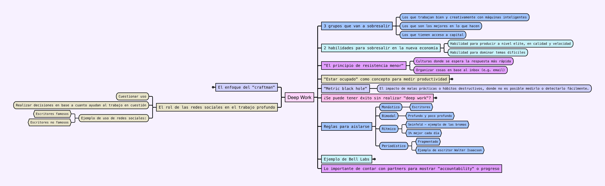

## Grabación
[Link a video en Youtube](https://youtu.be/bE4m2gGCNHM)

Disculpa por la primera parte en blanco. Estaba compartiendo la pizarra y no sabía que solo se iba a ver eso.
Mejoraré para la siguiente vez.

## Conversación

### Técnicas de productividad

* 🎯 Hablamos de poner en práctica la Técnica Pomodoro: trabaja durante 25 minutos, tómate un descanso de 5 minutos, repite 4 veces, y luego tómate un descanso de 15-30 minutos para mantener la concentración y evitar el agotamiento.

* ⏰ Hablamos también de la importancia de las primeras 2-3 horas de tu día a las tareas más importantes, ya que esto marca la pauta para el resto de tu día. Se sugiere en ["Los 7 Hábitos de la Gente Altamente Eficaz"](https://www.goodreads.com/book/show/40892897-los-7-h-bitos-de-la-gente-altamente-efectiva).

* 📚 Hábito para leer más: Crear un espacio sagrado de lectura colocando tu teléfono fuera de tu alcance antes de dormir, y empieza a leer inmediatamente después de despertarte y de ir al baño.

* 📱 Utilizar la [aplicación de Eleven Labs](https://elevenlabs.io/text-reader) para fotografiar y empezar a leer libros, ayudando a superar la parálisis de no leer.

### Formación de hábitos
* 🔍 Centrase en desarrollar la identidad que quieres tener (por ejemplo, ser una persona sana) en lugar de objetivos específicos para formar hábitos duraderos.

* 🍇 Adopta el concepto de "uva de la constancia" empezando con pequeñas versiones de los hábitos deseados y aumentándolas gradualmente con el tiempo.

* 🔎 Identifica y modifica los pequeños elementos de la rutina diaria que influyen en tus hábitos, como cambiar la ubicación de tu teléfono para romper el hábito de comprobarlo.

* 🎯 Determina la dosis mínima eficaz para cada hábito, que es la menor cantidad de tiempo o esfuerzo necesarios para conseguir el resultado deseado.

### Mentalidad de Productividad
* 📊 Concéntrate en mejorar los sistemas que apoyan o dificultan tus hábitos, en lugar de criticarte por no cumplir los objetivos.

* 🧠 Reconoce que los libros de productividad tienen un impacto diferente en los lectores en función de la edad, el contexto y la situación, así que céntrate en absorber lo que resuene personalmente.

### Estrategias de Trabajo Profundo
* 🎯 Practica el trabajo concentrado sin interrupciones, como se subraya en ["Enfócate"](https://www.goodreads.com/book/show/36509192-enfocate-trabajo-profundo) de Cal Newport, para producir trabajo de alta calidad con eficacia.

* 📧 Supera la tendencia a dar prioridad a los correos electrónicos sobre las tareas importantes reconociendo que es una forma de resistencia que puede obstaculizar la productividad.

### Técnicas para crear hábitos
* 🏗️ Aplica pequeños cambios sostenibles que puedan apilarse para mejorar la productividad y la eficacia, como se sugiere en ["Hábitos atómicos"](https://www.goodreads.com/es/book/show/47620585-habitos-atomicos) de James Clear.

* 🏆 Céntrate en conseguir pequeñas victorias para coger impulso y progresar con el tiempo al desarrollar nuevos hábitos.

### Contexto y Entorno
* 👥 Considera la importancia del contexto en la formación de hábitos, incluyendo la hora del día y las personas de las que te rodeas.

### Superar los retos
* 🔄 Cuando te sientas estancado, tómate un descanso de 15 minutos seguido de 25 minutos de trabajo concentrado para evitar el agotamiento y mantener la motivación.

### Tecnología y Enfoque
* 💻 Reconocer la creciente importancia de la concentración profunda en un mundo en el que la tecnología nos interrumpe constantemente, como se expone en ["Enfócate"](https://www.goodreads.com/book/show/36509192-enfocate-trabajo-profundo).

* 📱 Gestiona el reto de mantener el trabajo concentrado en entornos con constantes correos electrónicos o expectativas de estar de guardia aplicando estrategias de los libros de productividad.

## Recursos

## Libros que se hacen referencia

* ["Hábitos atómicos"](https://www.goodreads.com/es/book/show/47620585-habitos-atomicos)
* ["Enfócate"](https://www.goodreads.com/book/show/36509192-enfocate-trabajo-profundo)
* [The High 5 Method](https://www.goodreads.com/book/show/58505300-the-high-5-habit)
* ["Los 7 Hábitos de la Gente Altamente Eficaz"](https://www.goodreads.com/book/show/40892897-los-7-h-bitos-de-la-gente-altamente-efectiva)
* [Why we sleep?](https://www.goodreads.com/book/show/34466963-why-we-sleep)

